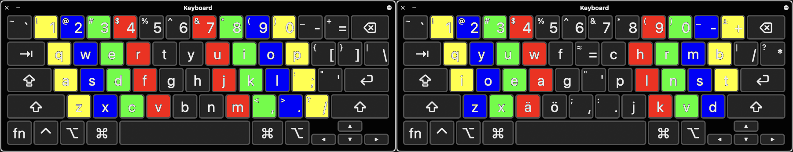
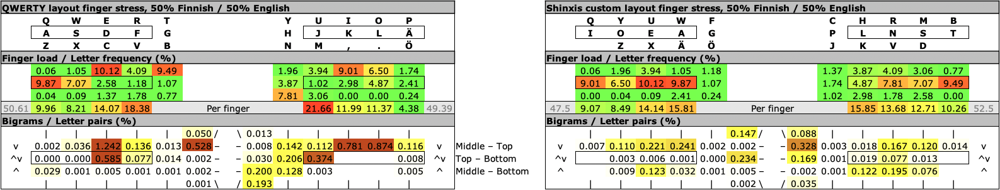

# Keyboard-Layout-Design
Designing a perfect keyboard layout. A [SpreadSheet tool](./Keymap_finger_load_public.ods) included. 
 
The traditional QWERTY computer keyboard is a relic straight from the mechanical typewriter. Today it is a major cause for repetitive strain injury and carpal tunnel syndrome, probably bested only by the mouse. 
 
The grid of the keyboard is undesirable. It was not designed symmetric hands in mind. None of the keys lie exactly above each other because, back in the days, the typewriter's lever arms were attached to the center of each key. An ortholinear or columnar split keyboard is the most ergonomic solution, but for laptops and such, even just the layout (key order) makes a huge difference. 
 
The following pictures show the proposals for finger movement in classic Ten-finger system (left) and a new custom layout (right). In the classic system, the left wrist is bent 90° to the side, the right hand is almost in the middle of the keyboard, and the right little finger has the most keys. In the new custom layout, the hands move more symmetrically, and the seldomly used keys are located at the harder-to-reach center, where they also can be seen easily. The keys at the sides are better accessible by ring finger too.  
 
 
 
It is easily shown that the QWERTY keyboard layout is far from optimal. The most used letters are scattered throughout the keyboard, and many recurring letter pairs are placed on the same finger. When the mechanical typewriter was designed this was an advantage - not having too fast typist, or the hammers of the keys stuck when the keys were hit too fast in succession.  
 
This example layout is optimized for 50% English and 50% Finnish language, but the spreadsheet tool can be fitted to any language and any weighting percentage. The QWERTY layout performs poorly regardless of the language. Here the starting point was the same as in Dvorak layout; vovels and consonants on different hands. Mac version of the example is here: [Shinxis-OSX.keylayout](./Shinxis-OSX.keylayout). 
 
 
 
To make your own keyboard layout, you may use these applications/methods: 
Mac OS X: &nbsp; 
          Ukelele 
Windows:  &nbsp;&nbsp;
          Microsoft Keyboard Layout Creator 
Linux:    &nbsp;&nbsp;&nbsp;&nbsp;&nbsp;&nbsp;&nbsp;&nbsp;
          Edit text files in /usr/share/X11/xkb/symbols/ 
iOS:      &nbsp;&nbsp;&nbsp;&nbsp;&nbsp;&nbsp;&nbsp;&nbsp;&nbsp;&nbsp;&nbsp;
          MyKeyboard / MyKeyboard Pro by Quintschaf GbR (paid App, under 10 eur, but well worth it) 
           
Learning a new layout can take time, but it is worth it. 
- The first version took me 2 months to master better than the QWERTY, but I was practising. 
-   
